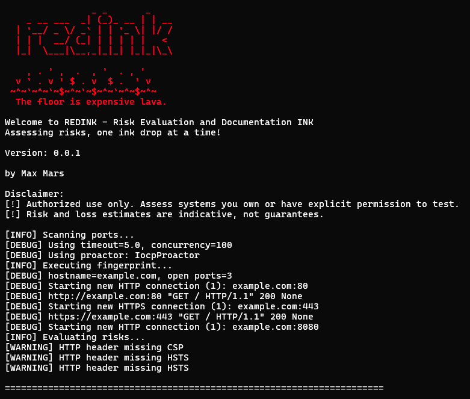
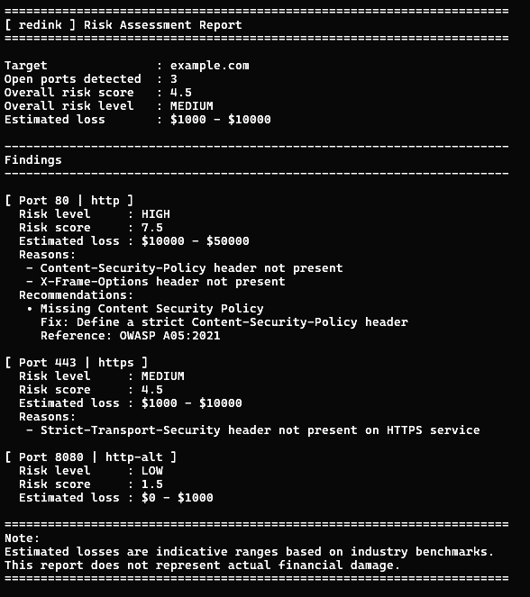

[](https://opensource.org/licenses/Apache-2.0) [](https://www.python.org/downloads/) [](https://www.kali.org/)

---

# Redink: Exposure & Risk Analysis Framework

Redink is a **read-only Exposure & Risk Analysis Framework** designed to identify configuration weaknesses, service exposures, and security misconfigurations that may lead to real business impact.

Unlike intrusive scanners or exploit-driven tools, Redink focuses on **context-aware risk assessment**, mapping technical findings to meaningful security risks while preserving operational safety.

## What Redink does

- Analyzes exposed services and configurations without exploiting them
- Translates technical exposure into contextual security risk
- Generates clear, auditable reports focused on decision-making

## User Interface



_Main Interface_



_Final Report_

## Project Philosophy

Redink is built on three clear principles:

- **Clarity**: clean output, consistent messaging, and well-defined errors.
- **Modularity**: each feature lives in its own module, fully decoupled from the core.
- **Professionalism**: structure, logging, and error handling aligned with the standards of tools accepted in Kali Linux.

This is not a standalone script. It is a tool designed to grow: new modules, new checks, new attack surfaces.

## Key Features

- **Modular and scalable architecture**
- Centralized **logging** and **custom error handling**
- Support for **risk levels** (risk ranges) in reports and outputs
- Clean CLI with verbosity control and silent mode
- Readable, documented, and maintainable codebase

## Project Documentation

This repository is structured around a set of focused documents that define REDINK from a technical, ethical, and strategic perspective:

- **Vision**

  - [`VISION`](./docs/vision.md) — Project purpose, long-term goals, and guiding ideas behind REDINK.

- **Architecture**

  - [`ARCHITECTURE`](./docs/architecture.md) — High-level system architecture, core components, and data flow.

- **CLI Specification**

  - [`CLI`](./docs/cli-contract.md) — Command-line interface contract, flags, execution modes, and expected behaviors.

- **Design Principles**

  - [`DESIGN`](./docs/design-principles.md) — Engineering principles, design decisions, and constraints guiding development.

- **Risk & Cost Model**
  - [`COST-MODEL`](./docs/cost-model.md) — Economic risk estimation model and rationale behind exposure-to-cost calculations.
- **Ethics & Legal**

  - [`ETHICS AND DISCLAIMER`](./docs/ethics-and-disclaimer.md) — Ethical use policy, scope limitations, and legal disclaimer.
  - [`SECURITY`](./SECURITY.md) — Vulnerability reporting process and security policy.
  - [`NOTICE`](./NOTICE) — Required attributions and notices under the Apache License 2.0.

- **Community Standards**
  - [`CONTRIBUTING`](./CONTRIBUTING.md) — Rules, principles, and requirements for contributing to the project.
  - [`CODE OF CONDUCT`](./CODE_OF_CONDUCT.md) — Expected behavior and community guidelines.

## Installation

> Recommended: Kali Linux or any Debian-based distribution.

Redink must be installed using `pipx`:
```bash
sudo apt install pipx 
git clone https://github.com/emilianotld/redink.git
cd redink
pipx ensurepath
pipx install .
```

## Basic Usage

```bash
redink <module> [options]
```

Examples:

```bash
redink 192.168.1.10 -vvv
```

```bash
redink google.com --ports 80,443
```

Common options:

- `-v, --verbose` : increases output detail
- `--silent` : suppresses all non-critical output
- `--ports` : specify target ports
- `--output` : exports results to a file

## Target Audience

- Cybersecurity students
- Junior pentesters
- Blue team / Purple team professionals
- Kali Linux users looking for clean and auditable tools

## Roadmap

- [x] Initial reconnaissance module
- [ ] JSON / YAML export support
- [ ] CI pipeline integration
- [ ] Full compatibility with Kali Linux repositories

> This first release focuses on stability, clarity, and a solid foundation rather than feature breadth.

## Contributing

Contributions are welcome, provided they respect:

- Code style guidelines
- Centralized error handling
- Minimum documentation per module

Pull Requests should be clear, justified, and focused.

## License

This project is licensed under the **Apache License 2.0**.

See the [`LICENSE`](/LICENSE) file for full details.

## Author

Alejandro Emiliano Toledo  
Also known as **Max Mars**

Creator and maintainer of Redink.

> Redink does not seek to make noise. It seeks to leave a mark.
